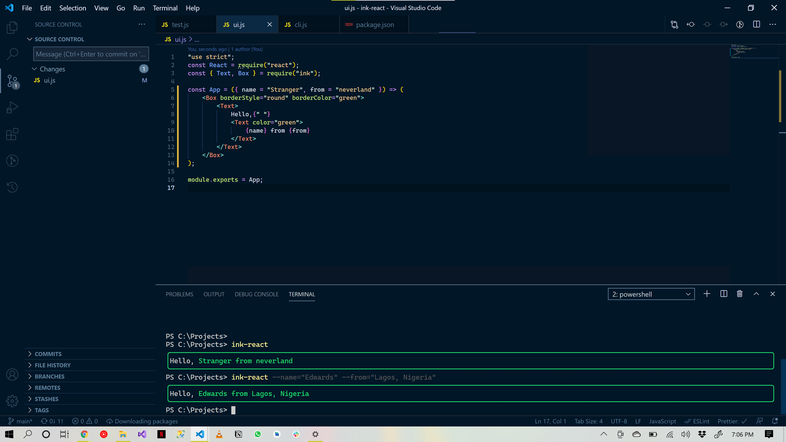

# ink-react

> This readme is automatically generated by [create-ink-app](https://github.com/vadimdemedes/create-ink-app)


## Install

```bash
$ npm install --global ink-react
```


## CLI

```
$ ink-react --help

  Usage
    $ ink-react

  Options
    --name  Your name
		--from  Your Location

  Examples
    $ ink-react --name=Edwards --from=Lagos
    Hello, Jane from Lagos
		
    
		
```
